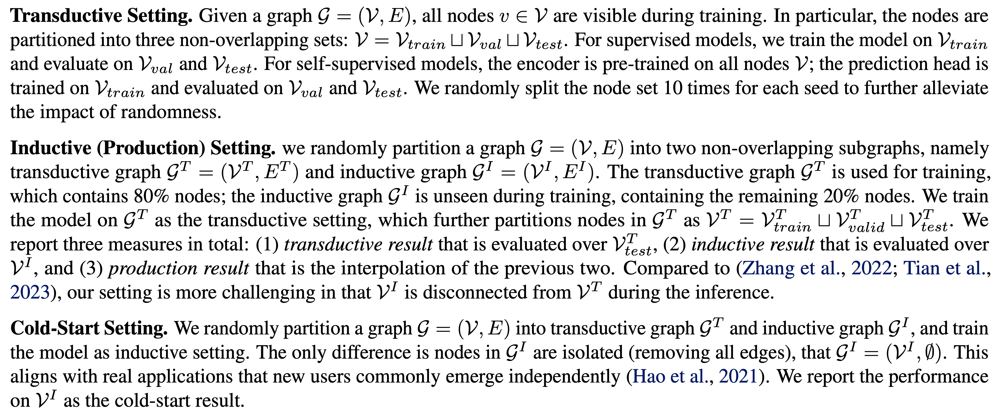
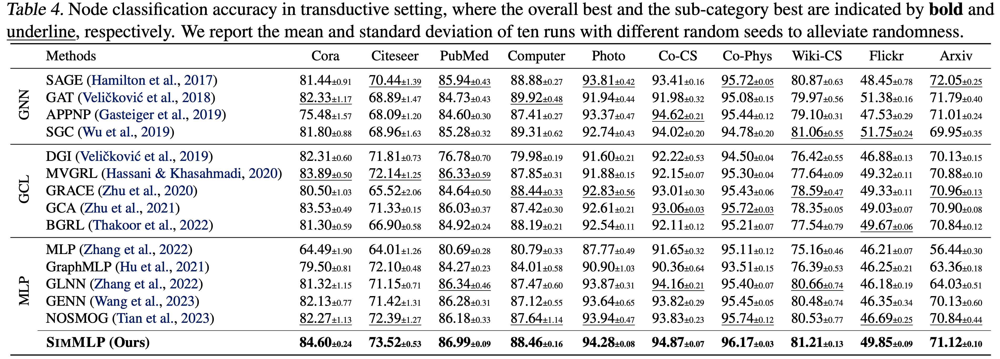

# A Simple Framework for Learning MLPs on Graph without Supervision

This repo presents implementation of SimMLP: A simple framework for learning MLPs on graphs without supervision. 

## Introduction

We present a simplified framework (SimMLP) to enhance model generalization, especially on unseen nodes. In particular, we employ self-supervised alignment between GNN and MLP embeddings to model the fine-grained and generalizable correlations between node features and graph structures. 


## Getting Started

### Setup Environment

We use conda for environment setup. Please run the bash as 
```
conda create -y -n SimMLP python=3.8
conda activate SimMLP

pip install -r requirements.txt
pip install pyg_lib torch_scatter torch_sparse torch_cluster torch_spline_conv -f https://data.pyg.org/whl/torch-2.1.0+cu121.html
```

Here a conda environment named `SimMLP` and install relevant requirements from `requirements.txt`. Be sure to activate the environment via `conda activate SimMLP` before running experiments as described. 

### Dataset Preparation

There is no need to prepare the datasets manually. It would be automatically downloaded via Pytorch Geometric library. Please refer to our paper for more specific dataset details. 

## Usage

### Basic Usage

To quickly run the model, please run `main.py` by specifying the experiment setting. Here is an example.

```
python main.py --setting trans --dataset cora --use_params
```

To ensure reproducibility of the paper, we provide the detailed hyper-parameters under `param` folder. You can use it by specifying `--use_params` in the script. 

### Dataset

We support ten public datasets, including `cora`, `citeseer`, `pubmed`, `amazon-cs`, `amazon-photo`, `co-cs`, `co-phys`, `wiki-cs`, `flickr`, `ogb-arxiv`. Please refer to the function `get_node_clf_dataset` in `dataset.py` for details. This enables the quick adaptation on new datasets. 

### Evaluation Settings

SimMLP can perform on three settings, including transductive, inductive, and cold-start. We describe these settings in the paper as: 



You can run these settings by specifying the `--setting trans` or `--setting ind`. Note for SimMLP, the inference phase is naturally structure-free, thus the cold-start result is equivalent to the *inductive result* in inductive setting. 


### Extension to Graph Classification

The basic usage is the same as node classification task, but it is unnecessary to specify the experimental settings. You only need to denote the dataset. We support `collab`, `dd`, `imdb-b`, `imdb-m`, `mutag`, `proteins`, `ptc-mr`. You can do extension in the function `get_graph_clf_dataset` under `dataset.py`. 

```
python main_graph.py --dataset collab --use_params
```

The hyper-parameters are also provided under `param/graph/`.

### Extension to Supervised Version

To run the experiments on supervised SimMLP, please run the following script. We only implement the model on transductive setting for simplicity. We encourage researchers to extend this in other two settings. 

```
python main_sup.py --dataset cora --use_params
```

As analyzed in the paper, the supervised version cannot achieve desirable performance. We consider it might because the inconsistency (or even conflict) between the supervised cross-entropy loss and the self-supervised alignment loss. We leave this in the future work. 

## Experimental Results

We present the experimental results on node classification with three settings. Please refer to the paper for more experimental results. 




